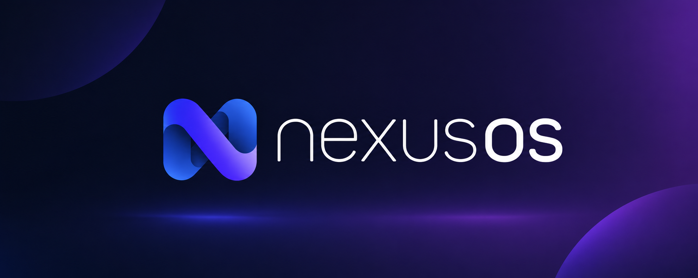

# NexusOS - Your Personal Cloud Hub. 
<!-- Readme i18n links -->
<!-- > English | [中文](#) | [Français](#) -->

<p align="center">
    <!-- NexusOS Banner -->
    <picture>
        <source media="(prefers-color-scheme: dark)" srcset="images/nexusosbanner.png">
        <source media="(prefers-color-scheme: light)" srcset="images/nexusosbanner.png">
        
    </picture>
    <br/>
    <i>Connect with the community, establish autonomy, reduce the cost of SaaS, and MAXIMIZE the potential for a personalized copilot.</i>
    <br/>
    <!-- NexusOS Links -->
    <a href="https://github.com/OManoSigma09/NexusOS" target="_blank">GitHub</a>&nbsp;&nbsp;&nbsp;
    <a href="https://github.com/OManoSigma09/NexusOS/wiki" target="_blank">Nexus Wiki</a>
    <br/>
    <br/>
    <!-- NexusOS Snapshots -->
    <kbd>
      <picture>
          <source media="(prefers-color-scheme: dark)" srcset="images/nexusosscreenshot.png">
          <source media="(prefers-color-scheme: light)" srcset="images/nexusosscreenshot.png">
          
      </picture>
    </kbd>
</p>

## Why NexusOS?

Your data. Your services. Your control.

NexusOS is a modern self-hosting platform designed to simplify server management without sacrificing power. It brings together applications, storage, automation, media, AI, and development tools into one elegant and easy-to-use interface.

Whether you're building a personal cloud, a homelab, or a small business server, NexusOS gives you the freedom to own your infrastructure while staying fast, secure, and private.

Simple enough for beginners. Powerful enough for enthusiasts.

> If you think what we are doing is valuable. Please **give us a star ⭐** and **fork it 🤞**!

## Features

- Modern and intuitive interface
  - A clean, responsive, and user-friendly experience.
- Built-in App Store
  - Install your favorite self-hosted applications with a single click.
- Wide app library
  - Access popular apps like Nextcloud, Jellyfin, Home Assistant, AdGuard Home, Immich, Pi-hole, the *arr suite, and many more.
- Powerful Docker integration
  - Deploy and manage thousands of Docker containers effortlessly.
- File management
  - Upload, organize, and manage your files directly from the web interface.
- Storage management
  - Monitor disks, SSDs, HDDs, and storage usage with ease.
- Real-time system monitoring
  - Keep track of CPU, memory, storage, and network usage at a glance.
- Fast and lightweight
  - Optimized for both modern hardware and older machines.
- Secure remote access
  - Manage your server from anywhere while keeping your data private.
- Open source
  - Transparent, customizable, and community-driven.

## Getting Started

NexusOS is fully compatible with Ubuntu, Debian, Raspberry Pi OS, and CentOS with one-liner installation.

### Hardware Compatibility

- amd64 / x86-64
- arm64
- armv7

### System Compatibility

Official Support
- Debian 12 (✅ Tested, Recommended)
- Ubuntu Server 20.04 (✅ Tested)
- Raspberry Pi OS (✅ Tested)

Community Support
- Elementary 6.1 (✅ Tested)
- Armbian 22.04 (✅ Tested)
- Alpine (🚧 Not Fully Tested Yet)
- OpenWrt (🚧 Not Fully Tested Yet)
- ArchLinux (🚧 Not Fully Tested Yet)

### Quick Setup NexusOS

Freshly install a system from the list above and run this command:

```sh
wget -qO- https://get.casaos.io | sudo bash
```

or

```sh
curl -fsSL https://get.casaos.io | sudo bash
```

### Update Nexus

NexusOs can be updated from the User Interface (UI), via `Settings ... Update`.  

Alternatively it can be updated from a terminal session.  To update from a terminal session, it must be done either from a secure shell (ssh) session to the device or from a directly attached terminal and keyboard to the device running NexusOS, this cannot be done from the terminal via the NexusOS User Interface (UI).  To update to the latest release of NexusOs from a terminal session run this command:

```sh
wget -qO- https://get.casaos.io/update | sudo bash
```

or

```sh
curl -fsSL https://get.casaos.io/update | sudo bash
```

To determine version of CasaOS from a terminal session run this command:

```sh
casaos -v
```


### Uninstall CasaOS


v0.3.3 or newer

```sh
casaos-uninstall
```

Before v0.3.3

```sh
curl -fsSL https://get.icewhale.io/casaos-uninstall.sh | sudo bash
```

## Community 

The word Casa comes from the Spanish word for "home". Project CasaOS originated as a pre-installed system for the crowdfunded product [ZimaBoard](https://www.zimaboard.com) on Kickstarter.

After looking at many systems and software on the market, the team found no server system designed for home scenarios, sadly true.

So, we set out to build this open-source project to develop CasaOS with our own hands, everyone in the community, and you.

We believe that through community-driven collaborative innovation and open communication with global developers, we can reshape the digital home experience like never before.

**A warm welcome for you to get help or share great ideas in the [Discord](https://discord.gg/knqAbbBbeX)!**

[](https://discord.gg/knqAbbBbeX)

## Contributing

CasaOS is a community-driven open source project and the people involved are CasaOS users. That means CasaOS will always need contributions from community members just like you!

- See <https://wiki.casaos.io/en/contribute> for ways of contributing to CasaOS
- See <https://wiki.casaos.io/en/contribute/development> if you want to be involved in code contribution specifically


## Credits

Many thanks to everyone who has helped CasaOS so far!

Everyone's contribution is greatly appreciated. ([Emoji Key](https://allcontributors.org/docs/en/emoji-key))

<!-- ALL-CONTRIBUTORS-LIST:START - Do not remove or modify this section -->
<!-- prettier-ignore-start -->
<!-- markdownlint-disable -->
<table>
  <tr>
    <td align="center"><a href="https://github.com/jerrykuku"><br /><sub><b>老竭力</b></sub></a><br /><a href="https://github.com/IceWhaleTech/CasaOS/commits?author=jerrykuku" title="Code">💻</a> <a href="https://github.com/IceWhaleTech/CasaOS/commits?author=jerrykuku" title="Documentation">📖</a> <a href="#ideas-jerrykuku" title="Ideas, Planning, & Feedback">🤔</a> <a href="#infra-jerrykuku" title="Infrastructure (Hosting, Build-Tools, etc)">🚇</a> <a href="#maintenance-jerrykuku" title="Maintenance">🚧</a> <a href="#platform-jerrykuku" title="Packaging/porting to new platform">📦</a> <a href="#question-jerrykuku" title="Answering Questions">💬</a> <a href="https://github.com/IceWhaleTech/CasaOS/pulls?q=is%3Apr+reviewed-by%3Ajerrykuku" title="Reviewed Pull Requests">👀</a></td>
    <td align="center"><a href="https://github.com/LinkLeong"><br /><sub><b>link</b></sub></a><br /><a href="https://github.com/IceWhaleTech/CasaOS/commits?author=LinkLeong" title="Code">💻</a> <a href="https://github.com/IceWhaleTech/CasaOS/commits?author=LinkLeong" title="Documentation">📖</a> <a href="#ideas-LinkLeong" title="Ideas, Planning, & Feedback">🤔</a> <a href="#infra-LinkLeong" title="Infrastructure (Hosting, Build-Tools, etc)">🚇</a> <a href="#maintenance-LinkLeong" title="Maintenance">🚧</a> <a href="#question-LinkLeong" title="Answering Questions">💬</a> <a href="https://github.com/IceWhaleTech/CasaOS/pulls?q=is%3Apr+reviewed-by%3ALinkLeong" title="Reviewed Pull Requests">👀</a></td>
    <td align="center"><a href="https://github.com/tigerinus"><br /><sub><b>太戈</b></sub></a><br /><a href="https://github.com/IceWhaleTech/CasaOS/commits?author=tigerinus" title="Code">💻</a> <a href="https://github.com/IceWhaleTech/CasaOS/commits?author=tigerinus" title="Documentation">📖</a> <a href="#ideas-tigerinus" title="Ideas, Planning, & Feedback">🤔</a> <a href="#infra-tigerinus" title="Infrastructure (Hosting, Build-Tools, etc)">🚇</a> <a href="#maintenance-tigerinus" title="Maintenance">🚧</a> <a href="#mentoring-tigerinus" title="Mentoring">🧑‍🏫</a> <a href="#security-tigerinus" title="Security">🛡️</a> <a href="#question-tigerinus" title="Answering Questions">💬</a> <a href="https://github.com/IceWhaleTech/CasaOS/pulls?q=is%3Apr+reviewed-by%3Atigerinus" title="Reviewed Pull Requests">👀</a></td>
    <td align="center"><a href="https://github.com/Lauren-ED209"><br /><sub><b>Lauren</b></sub></a><br /><a href="#ideas-Lauren-ED209" title="Ideas, Planning, & Feedback">🤔</a> <a href="#fundingFinding-Lauren-ED209" title="Funding Finding">🔍</a> <a href="#projectManagement-Lauren-ED209" title="Project Management">📆</a> <a href="#question-Lauren-ED209" title="Answering Questions">💬</a> <a href="https://github.com/IceWhaleTech/CasaOS/commits?author=Lauren-ED209" title="Tests">⚠️</a></td>
    <td align="center"><a href="https://JohnGuan.Cn"><br /><sub><b>John Guan</b></sub></a><br /><a href="#blog-JohnGuan" title="Blogposts">📝</a> <a href="#content-JohnGuan" title="Content">🖋</a> <a href="https://github.com/IceWhaleTech/CasaOS/commits?author=JohnGuan" title="Documentation">📖</a> <a href="#ideas-JohnGuan" title="Ideas, Planning, & Feedback">🤔</a> <a href="#eventOrganizing-JohnGuan" title="Event Organizing">📋</a> <a href="#mentoring-JohnGuan" title="Mentoring">🧑‍🏫</a> <a href="#question-JohnGuan" title="Answering Questions">💬</a> <a href="https://github.com/IceWhaleTech/CasaOS/pulls?q=is%3Apr+reviewed-by%3AJohnGuan" title="Reviewed Pull Requests">👀</a></td>
    <td align="center"><a href="https://blog.tippybits.com"><br /><sub><b>David Tippett</b></sub></a><br /><a href="https://github.com/IceWhaleTech/CasaOS/commits?author=dtaivpp" title="Documentation">📖</a> <a href="#ideas-dtaivpp" title="Ideas, Planning, & Feedback">🤔</a> <a href="#question-dtaivpp" title="Answering Questions">💬</a></td>
    <td align="center"><a href="https://github.com/zarevskaya"><br /><sub><b>Skaya</b></sub></a><br /><a href="#mentoring-zarevskaya" title="Mentoring">🧑‍🏫</a> <a href="#question-zarevskaya" title="Answering Questions">💬</a> <a href="#tutorial-zarevskaya" title="Tutorials">✅</a> <a href="#translation-zarevskaya" title="Translation">🌍</a></td>
  </tr>
  <tr>
    <td align="center"><a href="https://github.com/AuthorShin"><br /><sub><b>AuthorShin</b></sub></a><br /><a href="https://github.com/IceWhaleTech/CasaOS/commits?author=AuthorShin" title="Tests">⚠️</a> <a href="https://github.com/IceWhaleTech/CasaOS/issues?q=author%3AAuthorShin" title="Bug reports">🐛</a> <a href="#question-AuthorShin" title="Answering Questions">💬</a> <a href="#ideas-AuthorShin" title="Ideas, Planning, & Feedback">🤔</a></td>
    <td align="center"><a href="https://github.com/baptiste313"><br /><sub><b>baptiste313</b></sub></a><br /><a href="#translation-baptiste313" title="Translation">🌍</a></td>
    <td align="center"><a href="https://github.com/DrMxrcy"><br /><sub><b>DrMxrcy</b></sub></a><br /><a href="https://github.com/IceWhaleTech/CasaOS/commits?author=DrMxrcy" title="Tests">⚠️</a> <a href="#ideas-DrMxrcy" title="Ideas, Planning, & Feedback">🤔</a> <a href="#question-DrMxrcy" title="Answering Questions">💬</a></td>
    <td align="center"><a href="https://github.com/Joooost"><br /><sub><b>Joooost</b></sub></a><br /><a href="#ideas-Joooost" title="Ideas, Planning, & Feedback">🤔</a></td>
    <td align="center"><a href="https://potyarkin.ml"><br /><sub><b>Vitaly Potyarkin</b></sub></a><br /><a href="#ideas-sio" title="Ideas, Planning, & Feedback">🤔</a></td>
    <td align="center"><a href="https://github.com/bearfrieze"><br /><sub><b>Bjørn Friese</b></sub></a><br /><a href="#ideas-bearfrieze" title="Ideas, Planning, & Feedback">🤔</a></td>
    <td align="center"><a href="https://github.com/Protektor-Desura"><br /><sub><b>Protektor</b></sub></a><br /><a href="https://github.com/IceWhaleTech/CasaOS/issues?q=author%3AProtektor-Desura" title="Bug reports">🐛</a> <a href="#ideas-Protektor-Desura" title="Ideas, Planning, & Feedback">🤔</a> <a href="#question-Protektor-Desura" title="Answering Questions">💬</a></td>
  </tr>
  <tr>
    <td align="center"><a href="https://github.com/llwaini"><br /><sub><b>llwaini</b></sub></a><br /><a href="#projectManagement-llwaini" title="Project Management">📆</a> <a href="https://github.com/IceWhaleTech/CasaOS/commits?author=llwaini" title="Tests">⚠️</a> <a href="#tutorial-llwaini" title="Tutorials">✅</a></td>
    <td align="center"><a href="https://github.com/CorrectRoadH"><br /><sub><b>CorrectRoadH</b></sub></a><br /><a href="https://github.com/IceWhaleTech/CasaOS/commits?author=correctroadh" title="Code">💻</a> <a href="https://github.com/IceWhaleTech/CasaOS/commits?author=correctroadh" title="Documentation">📖</a></td>
    <td align="center"><a href="https://github.com/zhanghengxin"><br /><sub><b>zhanghengxin</b></sub></a><br /><a href="https://github.com/IceWhaleTech/CasaOS/commits?author=zhanghengxin" title="Code">💻</a> <a href="https://github.com/IceWhaleTech/CasaOS/commits?author=zhanghengxin" title="Documentation">📖</a></td>
  </tr>
</table>

<!-- markdownlint-restore -->
<!-- prettier-ignore-end -->

<!-- ALL-CONTRIBUTORS-LIST:END -->

This project follows the [all-contributors](https://github.com/all-contributors/all-contributors) specification. Contributions of any kind are welcome!

## Changelog

Detailed changes for each release are documented in the [release notes](https://github.com/IceWhaleTech/CasaOS/releases).

---

<p align="center">
    <a href="https://dashboard.trackgit.com/token/l5q8egi92tfhlxd70l2l">
        
    </a>
</p>
