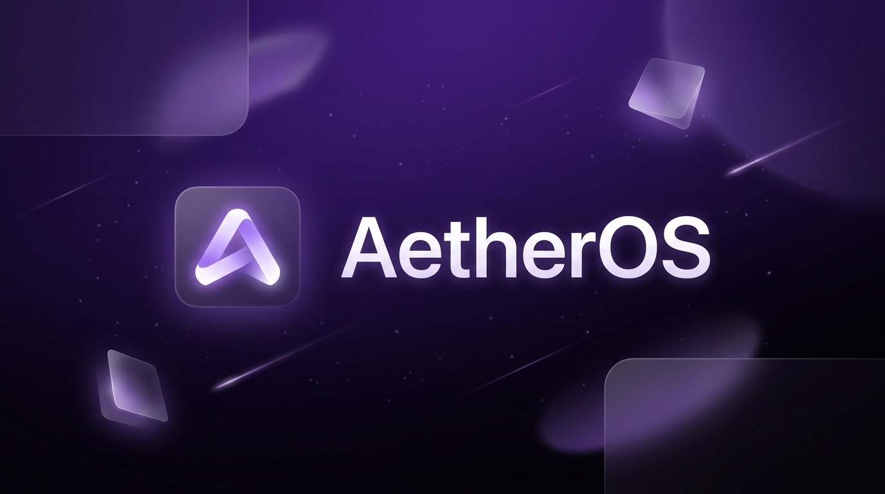

# AetherOS - Your Personal Cloud Hub. 
<!-- Readme i18n links -->
<!-- > English | [中文](#) | [Français](#) -->

<p align="center">
    <!-- Banner -->
    <picture>
        <source media="(prefers-color-scheme: dark)" srcset="images/aetherosbanner.png">
        <source media="(prefers-color-scheme: light)" srcset="images/aetherosbanner.png">
        
    </picture>
    <br/>
    <i>Connect with the community, establish autonomy, reduce the cost of SaaS, and MAXIMIZE the potential for a personalized copilot.</i>
    <br/>
    <!-- Links -->
    <a href="https://github.com/OManoSigma09/AetherOS" target="_blank">GitHub</a>&nbsp;&nbsp;&nbsp;
    <a href="https://github.com/OManoSigma09/AetherOS/wiki" target="_blank">AetherOS Wiki</a>
    <br/>
    <br/>
    <!-- Snapshots -->
    <kbd>
      <picture>
          <source media="(prefers-color-scheme: dark)" srcset="images/aetherosscreenshot.png">
          <source media="(prefers-color-scheme: light)" srcset="images/aetherosscreenshot.png">
          
      </picture>
    </kbd>
</p>

## Why AetherOS?

Your data. Your services. Your control.

AetherOS is a modern self-hosting platform designed to simplify server management without sacrificing power. It brings together applications, storage, automation, media, AI, and development tools into one elegant and easy-to-use interface.

Whether you're building a personal cloud, a homelab, or a small business server, AetherOS gives you the freedom to own your infrastructure while staying fast, secure, and private.

Simple enough for beginners. Powerful enough for enthusiasts.

> If you think what we are doing is valuable. Please **give us a star ⭐** and **fork it 🤞**!

## Features

- Modern and intuitive interface
  - A clean, responsive, and user-friendly experience.
- Built-in App Store
  - Install your favorite self-hosted applications with a single click.
- Wide app library
  - Access popular apps like Nextcloud, Jellyfin, Home Assistant, AdGuard Home, Immich, Pi-hole, the *arr suite, and many more.
- Powerful Docker integration
  - Deploy and manage thousands of Docker containers effortlessly.
- File management
  - Upload, organize, and manage your files directly from the web interface.
- Storage management
  - Monitor disks, SSDs, HDDs, and storage usage with ease.
- Real-time system monitoring
  - Keep track of CPU, memory, storage, and network usage at a glance.
- Fast and lightweight
  - Optimized for both modern hardware and older machines.
- Secure remote access
  - Manage your server from anywhere while keeping your data private.
- Open source
  - Transparent, customizable, and community-driven.

## Getting Started

AetherOS is fully compatible with Ubuntu, Debian, Raspberry Pi OS, and CentOS with one-liner installation.

### Hardware Compatibility

- amd64 / x86-64
- arm64
- armv7

### System Compatibility

Official Support
- Debian 12 (✅ Tested, Recommended)
- Ubuntu Server 20.04 (✅ Tested)
- Raspberry Pi OS (✅ Tested)

Community Support
- Elementary 6.1 (✅ Tested)
- Armbian 22.04 (✅ Tested)
- Alpine (🚧 Not Fully Tested Yet)
- OpenWrt (🚧 Not Fully Tested Yet)
- ArchLinux (🚧 Not Fully Tested Yet)

### Quick Setup AetherOS

Freshly install a system from the list above and run this command:

```sh
Coming Soon :)
```

or

```sh
Coming Soon :)
```

### Update AetherOS

AetherOS can be updated from the User Interface (UI), via `Settings ... Update`.  

Alternatively it can be updated from a terminal session.  To update from a terminal session, it must be done either from a secure shell (ssh) session to the device or from a directly attached terminal and keyboard to the device running AetherOS, this cannot be done from the terminal via the NexusOS User Interface (UI).  To update to the latest release of NexusOs from a terminal session run this command:

```sh
Coming Soon :)
```

or

```sh
Coming Soon :)
```

To determine version of AetherOS from a terminal session run this command:

```sh
Coming Soon :)
```


### Uninstall AetherOS


v0.3.3 or newer

```sh
Coming Soon :)
```

Before v0.3.3

```sh
Coming Soon :)
```


